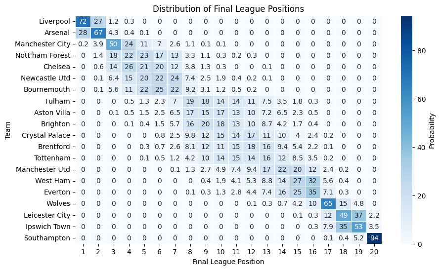
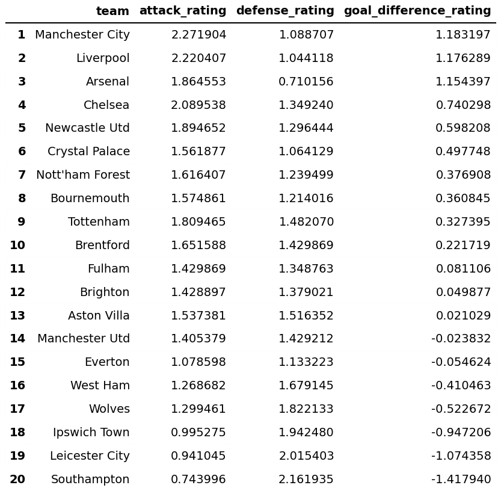

# Introduction

The notebook poisson_model.ipynb creates a simple poisson model for predicting the Premier League season final rankings. 

# Final league position predictions

# Team rankings

In this dataframe, 'attack_rating' refers to expected number of goals the team would score against average PL opponents in a neutral venue. Similarly, 'defense_rating' refers to expected goals allowed against average PL opponents in a neutral venue. Finally, 'goal_difference_rating' is simply the difference of the previous two.

