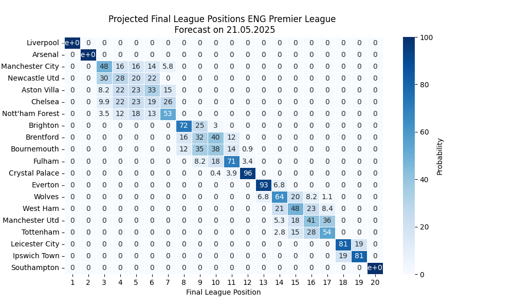

# Introduction

The script src/dixon_coles.py can be used to evaluate the strenght of each football team in a given league and simulate season end rankings. Supported leagues currently are the English Premier League, Spanish La Liga and Finnish Veikkausliiga. 

# Final league position predictions

# Team rankings

In this dataframe, 'attack_rating' refers to expected number of goals the team would score against average PL opponents in a neutral venue. Similarly, 'defense_rating' refers to expected goals allowed against average PL opponents in a neutral venue. Finally, 'goal_difference_rating' is simply the difference of the previous two.

